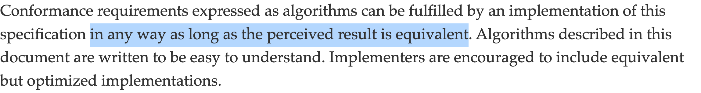

class: center middle

.font-size-6.weight-700[
Scaling GraphQL for .tc-underline[500,000,000] req/min
]

---

class: middle

# whoami

## .tc-underline[Tushar Mathur]

- GraphQL Enthusiast

- Open Source Contributor

- Passionate about DevEx

---

class: middle

## .font-grey[Part 1]

# .tc-underline[GraphQL Journey]

---

# 2016 Dream11

- .tc-underline[Fantasy Gaming Platform]

- .tc-underline[Early Stage]

- .tc-underline[Monolith to Microservices Considerable Scale]

--

## .block.center[.font-size-5[🧐 .weight-700.tc-underline[GraphQL?]]]

---

## Architecture

.block.center[.size-75[]]

--

.block.center[GraphQL as .tc-underline[client-side abstraction] ]

---

# 2022 Dream11

.stat[

.stat-item[500 .title[Engineers]]

.stat-item[150 .title[Microservices]]

.stat-item[10,000,000 .title[Concurrency]]

.stat-item[200,000,000 .title[Users]]

]

--

<!-- Key Point -->

## .block.center[.font-size-5[🙌 .weight-700.tc-underline[GraphQL]]]

---

class: middle

# Saved the day...

.img-fixed-right[]

---

class: middle

# .tc-underline[Not so fast!]

.img-fixed-right[]

---

class: middle

## .font-grey[Part 2]

# .tc-underline[Challenges]

---

# 1. .tc-underline[Performance]

--

## 👍 .font-grey[Latency & Throughput]

--

## 👎 .font-grey[Infrastructure]

--

.flex.flex-center[.stat-item[50,000 .title[CORES]]]

---

## Things that .tc-underline[worked] for us

--

👉 .font-grey[Micro Optimizations]

--

👉 .font-grey[Infrastructure Tuning]

--

👉 .font-grey[Benchmarking]

--

👉 .font-grey[Caching on Upstream]

--

.right-50[.flex.flex-center[.stat-item[6,400 .title[CORES]]]]

--

<!-- Key Point -->

.block.center[.font-size-5[🚨 .weight-700.tc-underline[High Priority]]]

---

# 2. .tc-underline[Reliability]

--

## 👎 .font-grey[Fragility]

--

--

## 👎 .font-grey[Resiliency]

---

## Things that .tc-underline[worked] for us

--

👉 .font-grey[Redefining Processes]

--

👉 .font-grey[Micro-optimizing Cold Paths]

--

👉 .font-grey[Rate Limiting & Circuit Breaking]

--

&nbsp;

<!-- Key Point -->

.block.center[.font-size-5[❌ .weight-700.tc-underline[Query Cost]]]

---

# 3. .tc-underline[Maintainability]

--

❓ .font-grey[Library Upgrades]

❓ .font-grey[Unused Nodes]

❓ .font-grey[Data Loaders]

❓ .font-grey[Unimplemented Resolver]

❓ .font-grey[Code Duplication]

❓ .font-grey[...]

--

.img-fixed-right[]

---

class: middle

# .tc-underline[Summary]

|                |         |
| :------------- | :-----: |
| 1. Performance | ⭐️⭐️✩ |
| 2. Reliability | ⭐️⭐️✩ |
| 3. Maintenance |   ✩✩✩   |

---

class: middle

## .font-grey[Part 3]

# .tc-underline[Learnings of 8 Years]

---

class:middle center

.font-size-3.weight-700[🕊️ Liberties Constraint and Constraints Liberate🕊️]

---

class: middle

# .tc-underline[Liberties]

.img-fixed-right[]

---

class: middle

# .tc-underline[Constraints]

.center[]

---

# .tc-underline[GraphQL]

## 1. Schema

## 2. Query

## 3. Resolver

---

class: center middle

## .block.center[.font-size-5[🕊️ .weight-700.tc-underline[Resolver] 🕊️]]



---

class: middle

.font-grey[Step 1]

## ✋ .weight-700.tc-underline[Avoid Business Logic]

## 👍 .weight-700.tc-underline[Allow only Orchestration Logic]

---

class: middle

.font-grey[Step 2]

## 🙅‍♂️ .weight-700.tc-underline[No Handwritten Resolver]

## 🤔 .weight-700.tc-underline[Configuration Based]

---

class: middle

.font-grey[Step 3]

.font-size-3[🤔 .weight-700.tc-underline[Learn from SQL]]

&nbsp;

.size-50[]

---

class:middle

## .font-grey[Part 4]

# .tc-underline[Generalized] Runtime for GraphQL

---

class: middle center flex-col

.invert[]

---

class: middle

.invert.right-50.rust-logo[]

.font-size-3.weight-500[Built with 💗 using]

.font-size-3.weight-500.tc-underline[Apache 2.0 License]

.font-size-3.weight-500[High Performance]

---

class: middle

# How does it work?

---

class: middle flex-row

## .tc-underline[GraphQL Schema 👉]

.right-50[

```graphql
schema {
  query: Query
}

type Query {
  posts: [Post]
}

type Post {
  id: ID!
  title: String!
  body: String
  userId: ID!
  user: User
}

type User {
  id: ID!
  name: String!
  email: String!
}
```

]

---

class: middle

## .tc-underline[Annotate 👉]

.right-50[

```graphql
schema @upstream(baseURL: "https://api.d11.local") {
  query: Query
}

type Query {
  posts: [Post] @http(path: "/posts")
}

type Post {
  id: ID!
  title: String!
  body: String
  userId: ID!
  user: User @http(path: "/users/{{value.userId}}")
}

type User {
  id: ID!
  name: String!
  email: String!
}
```

]

---

class: middle

## .tc-underline[Start the server]

<pre style="color: #FFFFFF;font-size:0.8em;line-height:1.2em;">
❯ <span style="color: #00FF00;">tailcall</span> start config.graphql
  <span style="color: #00FF00;">INFO</span> File read: config.graphql ... ok  
  <span style="color: #00FF00;">INFO</span> 🚀 Tailcall launched at [127.0.0.1:8000] over HTTP/1.1
</pre>

---

# .tc-underline[First Class Support]

&nbsp;

- REST

- gRPC

- GraphQL

--

.operators.right-50[
`@addField`
`@cache`
`@call`
`@expr`
`@graphQL`
`@grpc`
`@http`
`@link`
`@modify`
`@omit`
`@rest`
`@server`
`@telemetry`
`@upstream`
]

--

.block.center[.font-size-4[💪 .weight-700.tc-underline[Router]]]

---

class: middle

.font-grey[Constraints that Liberate]

# .tc-underline[2 Key Capabilities]

---

class: middle

# .tc-underline[AOT Analyzer]

<pre style="color: #FFFFFF;margin-left:-8%;line-height:1.2em;">
  ❯ <span style="color: #00FF00;">tailcall</span> start config.graphql
    <span style="color: #00FF00;">INFO</span> File read: config.graphql ... ok
    <span style="color: #00FF00;">INFO</span> N + 1 detected: 1
    <span style="color: #FF0000;">ERROR</span> <span style="color: #FFFF00;">Invalid Configuration</span>
    <span style="color: #AAAAAA;">Caused by:</span>
    • <span style="color: #BFBFBF;">argument 'id' is a nullable type</span><span style="color: #00FFFF;"> [at Query.args.id]</span>  
</pre>

---

class:middle

# .tc-underline[JIT Optimizer]


---

class: middle

# Revisiting the Challenges

|                               |  Before   | .invert.size-50[] |
| ----------------------------- | :-------: | :--------------------------------------------------: |
| 1. Performance                |  ⭐️⭐️✩  |                      ⭐️⭐️⭐️                       |
| 2. Reliability                |  ⭐️⭐️✩  |                      ⭐️⭐️⭐️                       |
| 3. Maintenance                |    ✩✩✩    |                      ⭐️⭐️⭐️                       |
| 4. .tc-underline[Flexibility] | ⭐️⭐️⭐️ |                       ⭐️ ✩ ✩                        |

---

## .tc-underline[Awesome] Community 🙌

.center[]

---

class: middle

## .font-grey[Part 5]

# Takeaway

---

class: middle

## Takeaway

1. Innovation on GraphQL .tc-underline[performance] is necessary.

2. .tc-underline[Handwritten] GraphQL is difficult to maintain.

3. Library authors should take inspiration from .tc-underline[SQL engines].

---

.col-60[

# \#TailcallHack

- Build the .tc-underline[fastest] GraphQL Server

- Checkout - tailcallhq/hackathon

]

.right-50[
.size-50.flex-row.flex-center[]
]

&nbsp;

## .block[.font-size-5[$ .weight-700.tc-underline[5,000]]]

---

class: middle

# .center[.tc-underline[Thank You! ❤️]]

## Tushar Mathur

1. Founder of Tailcall

2. Ex VP of Engineering at Dream11 (2016-2022)

.flex-row[

.col-grow[
.icon[]
@tusharmath
]
.col-grow[
.icon[]
@tusharmath
]
.col-grow[
.icon[]
@tusharmath
]
]
