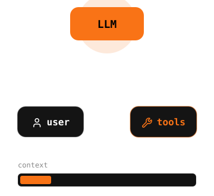
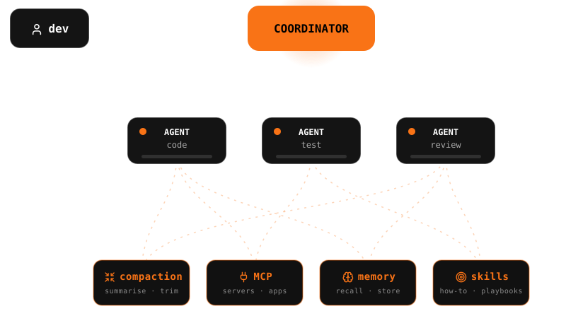
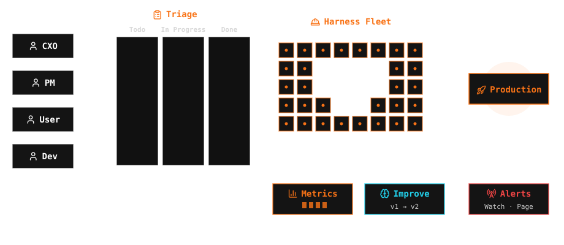
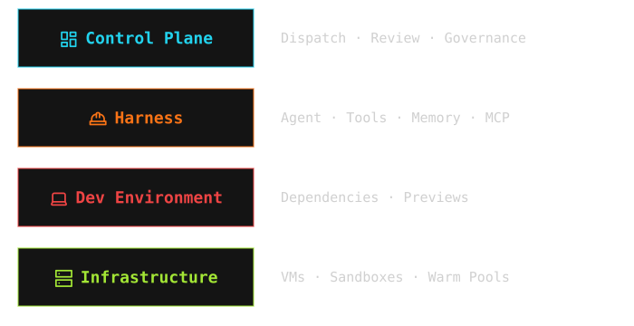
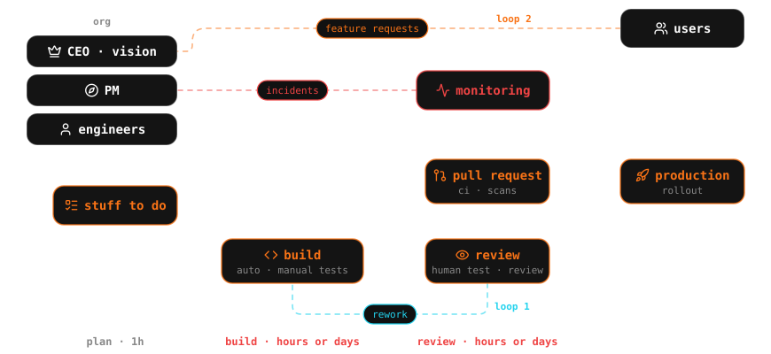

class: center middle

.font-size-4.weight-700[
State of the Art of .tc-underline[Coding Agents] 2026
]

---

class: middle fig

.split[
.split-left[

# .icon[] .tc-underline[Agent] .font-grey[1/3]

]
.split-right.agent-fig[]
]

---

class: middle

# .icon[] .tc-underline[Harness] .font-grey[2/3]

---

class: middle fig

.block.center.figure[]

--

.block.center[

### .icon[] .tc-underline[Individual] Productivity

]

---

class: middle

# .icon[] .tc-underline[Factory] .font-grey[3/3]

---

class: middle fig

.block.center.figure[]

--

.block.center[

### .icon[] .tc-underline[Organizational] Velocity

]

---

class: middle fig

.block.center.figure[]

--

.block.center[

### .icon[] .tc-underline[Anatomy] of a Software Factory

]

---

class: middle fig

.block.center.figure[]

--

.block.center[

### .icon[] Not .tc-underline[Issue] to PR, the Whole Loop

]
