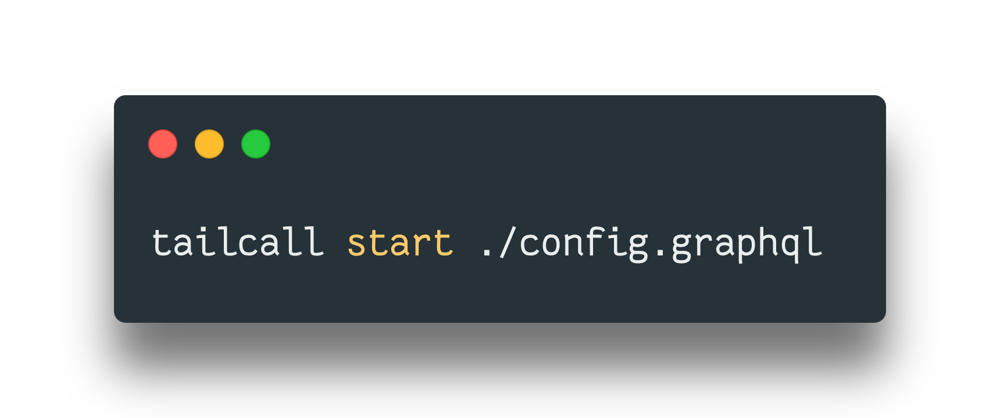
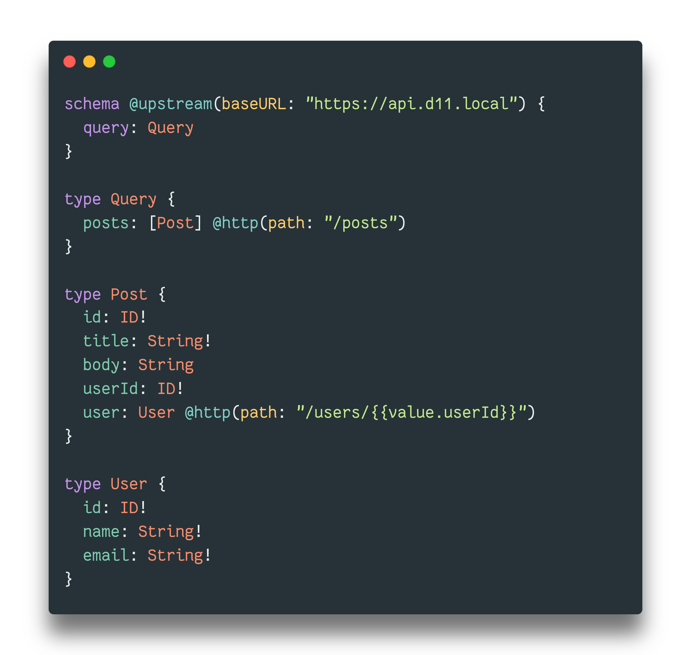
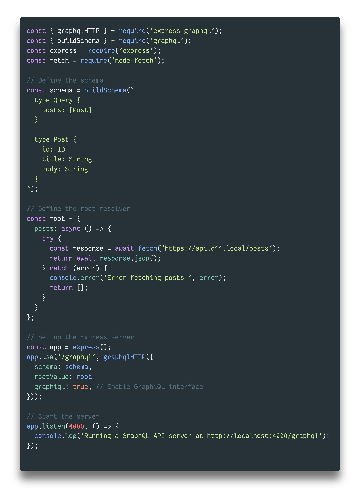
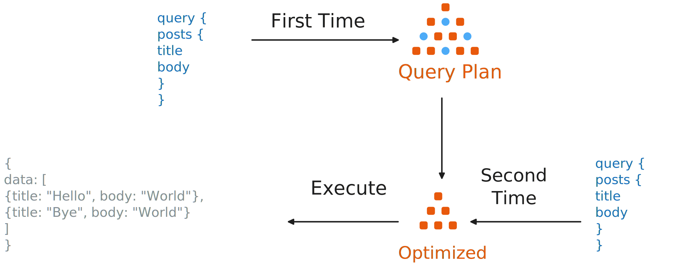

class: center middle

.font-size-6.weight-500[
Scaling GraphQL for .custom-underline[500,000,000] req/min
]

GraphQL Conf 2024

---

class: middle

# Who am I?

- GraphQL Enthusiast

- Open Source Contributor

- Passionate about DevEx

.img-fixed-right[]

---

class: middle

## .font-grey[Part 1]

# GraphQL Journey

---

# 2016 Dream11

- Fantasy Gaming Platform

- Monolith to Microservices

--

## .block.center[.font-size-5[🧐 .weight-700.custom-underline[GraphQL?]]]

---

## .custom-underline[Architecture]

.block.center[.size-75[]]

--

.block.center[{ Microservices + Apps }]

---

# 2022 Dream11

.stat[

.stat-item[500 .title[Engineers]]

.stat-item[150 .title[Microservices]]

.stat-item[10,000,000 .title[Concurrency]]

.stat-item[200,000,000 .title[Users]]

]

--

## .block.center[.font-size-5[🙌 .weight-700.custom-underline[GraphQL]]]

---

.block.center[]

---

class: middle

## .font-grey[Part 2]

# Challenges & Workarounds

---

.font-size-3[👉 .weight-700.custom-underline[Speculative Performance]]

--

.font-size-3[🚀] .font-grey[End-to-End]

.font-size-3[💔] .font-grey[Internal]

--

.font-size-3[🏭] .font-grey[Benchmarking Infrastructure]

---

.font-size-3[👉 .weight-700.custom-underline[Highly Specialized]]

--

.font-size-3[🎯] .font-grey[Dedicated Team]

---

.font-size-3[👉 .weight-700.custom-underline[Fragility]]

--

.font-size-3[🌀] .font-grey[Processes]

.font-size-3[🧪] .font-grey[Testing Infrastructure]

---

.font-size-3[👉 .weight-700.custom-underline[Caching]]

--

.font-size-3[⚡] .font-grey[On Services]

---

.font-size-3[👉 .weight-700.custom-underline[Resiliency]]

--

.font-size-3[🛡️] .font-grey[API Gateway]

---

.font-size-3[👉 .weight-700.custom-underline[Maintainability]]

--

.block[.font-size-3[😱]]

---

## .custom-underline[Challenges]

|                            | Workarounds |
| -------------------------- | :---------: |
| 1. Speculative Performance |    ⭐️✩✩    |
| 2. Highly Specialized      |     ✩✩✩     |
| 3. Fragile                 |    ⭐️✩✩    |
| 4. Caching                 |    ⭐️✩✩    |
| 5. Resiliency              |    ⭐️✩✩    |
| 6. Maintenance             |     ✩✩✩     |

---

class: middle

## .font-grey[Part 3]

# Learnings of 8 Years

---

class:middle center

.font-size-3.weight-700[🕊️ Liberties Constraint and Constraints Liberate🕊️]

---

# GraphQL

--

### 🔒 .custom-underline[Schema]

### 🔒 .custom-underline[Query]

--

### 🕊️ .custom-underline[Resolver]

---

class: middle

.font-grey[Step 1]

## ✋ .weight-700.custom-underline[Avoid Business Logic]

## 👍 .weight-700.custom-underline[Allow only Orchestration Logic]

---

class: middle

.font-grey[Step 2]

## 🙅‍♂️ .weight-700.custom-underline[Handwritten Resolver]

## 🤔 .weight-700.custom-underline[Configuration Driven]

---

class: middle

.font-grey[Step 3]

.font-size-3[🤔 .weight-700.custom-underline[Learn from SQL]]

TODO: Add image for Apache Calcite

---

class:middle

## .font-grey[Part 4]

# .custom-underline[Generalized Runtime for GraphQL]

---

class: middle center flex-col

.invert[]

---

class: middle flex-row

.col-60[
.custom-underline[## GraphQL Schema 👉]
]
.col-40[

```graphql
schema {
  query: Query
}

type Query {
  posts: [Post]
}

type Post {
  id: ID!
  title: String!
  body: String
  userId: ID!
  user: User
}

type User {
  id: ID!
  name: String!
  email: String!
}
```

]

---

class: middle flex-row

.col-40[
.custom-underline[## Annotate 👉]
]
.col-60[

```graphql
schema @upstream(baseURL: "https://api.d11.local") {
  query: Query
}

type Query {
  posts: [Post] @http(path: "/posts")
}

type Post {
  id: ID!
  title: String!
  body: String
  userId: ID!
  user: User @http(path: "/users/{{value.userId}}")
}

type User {
  id: ID!
  name: String!
  email: String!
}
```

]

---

# Start the server



---

# Upstream

- REST

- gRPC

- GraphQL

--

.block.center[.font-size-4[🎨 .weight-700.custom-underline[Router]]]

---

class: middle flex-row

.col-50[

## Comparison

.size-75[]

]
.col-50[
.size-75[]
]

---

class: middle

# How it works

---

# Initialization

<!-- TODO: add an excalidraw visual  -->

- Read the configuration

- Dynamically Generate Resolvers

- Initialize HTTP Server

.block.center.size-75[]

---

# Query Execution



---

class: middle

.center[]

---

## .custom-underline[Revisiting the Challenges]

|                            | Before | .invert.size-50[] |
| -------------------------- | :----: | :--------------------------------------------------: |
| 1. Speculative Performance | ⭐️✩✩  |                      ⭐️⭐️⭐️                       |
| 2. Highly Specialized      |  ✩✩✩   |                      ⭐️⭐️⭐️                       |
| 3. Fragile                 | ⭐️✩✩  |                      ⭐️⭐️⭐️                       |
| 4. Caching                 | ⭐️✩✩  |                      ⭐️⭐️⭐️                       |
| 5. Resiliency              | ⭐️✩✩  |                      ⭐️⭐️⭐️                       |
| 6. Maintenance             |  ✩✩✩   |                      ⭐️⭐️⭐️                       |

---

class: middle center

.invert[]

## Built with 💗 using

---

## .custom-underline[Awesome Community 🙌]

## 

---

class: middle

## .font-grey[Part 5]

# Takeaway

---

class: middle

## .custom-underline[Takeaway]

1. Innovation on GraphQL performance is necessary.

2. Handwritten GraphQL is difficult to maintain.

3. Library authors should take inspiration from SQL engines.

---

class: middle

## .custom-underline[Official Introduction]

1. Founder of Tailcall

2. Ex VP of Engineering at Dream11

.flex-row[

.col-grow[
.icon[]
@tusharmath
]
.col-grow[
.icon[]
@tusharmath
]
.col-grow[
.icon[]
@tusharmath
]
]

---

class: flex-row middle

.col-60[

# .custom-underline[\#TailcallHack]

- Build the GraphQL Server

- 2,000 USD Prize

- Checkout - tailcallhq/hackathon

]

.col-40.center[
.middle.size-50[]
]

---

class: flex-col center

# Thank You!

.font-size-5[❤️]
