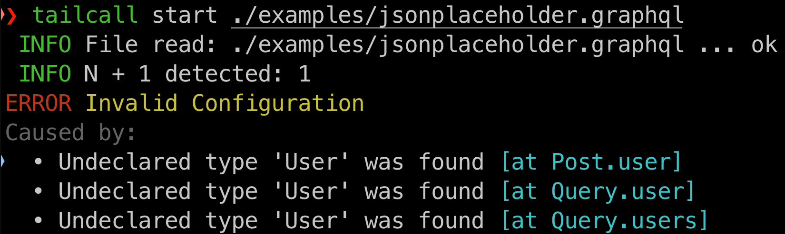

class: center middle

.font-size-6.weight-700[
Scaling GraphQL for .tc-underline[500,000,000] req/min
]
GraphQL Conf 2024

---

class: middle

# whoami

## Tushar Mathur

- GraphQL Enthusiast

- Open Source Contributor

- Passionate about DevEx

.img-fixed-right[]

---

class: middle

## .font-grey[Part 1]

# GraphQL Journey

---

# 2016 Dream11

- Fantasy Gaming Platform

- Monolith to Microservices

--

## .block.center[.font-size-5[🧐 .weight-700.tc-underline[GraphQL?]]]

---

## .tc-underline[Architecture]

.block.center[.size-75[]]

--

.block.center[GraphQL as .tc-underline[client-side abstraction] ]

---

# 2022 Dream11

.stat[

.stat-item[500 .title[Engineers]]

.stat-item[150 .title[Microservices]]

.stat-item[10,000,000 .title[Concurrency]]

.stat-item[200,000,000 .title[Users]]

]

--

## .block.center[.font-size-5[🙌 .weight-700.tc-underline[GraphQL]]]

---

class: middle

# Saved the day...

.img-fixed-right[]

---

class: middle

# .tc-underline[Not so fast!]

.img-fixed-right[]

---

class: middle

## .font-grey[Part 2]

# .tc-underline[Challenges]

---

# 1. .tc-underline[Performance]

--

## 🚀 .font-grey[End-to-End]

--

## 💔 .font-grey[Internal]

--

.right-50[
.stat[
.stat-item[\>50,000 .title[CORES]]
]  
]

--

## 👍 .font-grey[Benchmarking Infrastructure]

--

## 👍 .font-grey[Caching on Upstream]

---

# 2. .tc-underline[Reliability]

--

## 🌀 .font-grey[Monolithic]

--

## 🤷 .font-grey[Lack of Ownership]

--

## ❌ .font-grey[Query Cost]

--

## 🛡️ .font-grey[Rate Limiting & Circuit Breaking]

---

# 3. .tc-underline[Maintainability]

--

❓ Library Upgrades

❓ Unused Nodes

❓ Data Loaders

❓ Breaking Changes

❓ ...

--

.img-fixed-right[]

---

class: middle

## .tc-underline[Challenges & Workarounds]

|             |       |
| :---------- | :---: |
| Performance | ⭐️✩✩ |
| Reliability | ⭐️✩✩ |
| Maintenance |  ✩✩✩  |

---

class: middle

## .font-grey[Part 3]

# Learnings of 8 Years

---

class:middle center

.font-size-3.weight-700[🕊️ Liberties Constraint and Constraints Liberate🕊️]

---

class: middle

# .tc-underline[Liberties]

.img-fixed-right[]

---

class: middle

# .tc-underline[Constraints]

.center[]

---

# .tc-underline[GraphQL]

## 1. Schema

## 2. Query

## 3. Resolver

---

class: center middle

## .block.center[.font-size-5[🕊️ .weight-700.tc-underline[Resolver] 🕊️]]


---

class: middle

.font-grey[Step 1]

## ✋ .weight-700.tc-underline[Avoid Business Logic]

## 👍 .weight-700.tc-underline[Allow only Orchestration Logic]

---

class: middle

.font-grey[Step 2]

## 🙅‍♂️ .weight-700.tc-underline[Handwritten Resolver]

## 🤔 .weight-700.tc-underline[Configuration Based]

---

class: middle

.font-grey[Step 3]

.font-size-3[🤔 .weight-700.tc-underline[Learn from SQL]]

&nbsp;

.size-50[]

---

class:middle

## .font-grey[Part 4]

# .tc-underline[Generalized Runtime for GraphQL]

---

class: middle center flex-col

.invert[]

---

class: middle flex-row

## .tc-underline[GraphQL Schema 👉]

.right-50[

```graphql
schema {
  query: Query
}

type Query {
  posts: [Post]
}

type Post {
  id: ID!
  title: String!
  body: String
  userId: ID!
  user: User
}

type User {
  id: ID!
  name: String!
  email: String!
}
```

]

---

class: middle

## .tc-underline[Annotate 👉]

.right-50[

```graphql
schema @upstream(baseURL: "https://api.d11.local") {
  query: Query
}

type Query {
  posts: [Post] @http(path: "/posts")
}

type Post {
  id: ID!
  title: String!
  body: String
  userId: ID!
  user: User @http(path: "/users/{{value.userId}}")
}

type User {
  id: ID!
  name: String!
  email: String!
}
```

]

---

## Start the server


---

# .tc-underline[First Class Support]

&nbsp;

- REST

- gRPC

- GraphQL

--

.right-50.operators[
`@addField`
`@cache`
`@call`
`@expr`
`@graphQL`
`@grpc`
`@http`
`@link`
`@modify`
`@omit`
`@rest`
`@server`
`@telemetry`
`@upstream`
]

--

.block.center[.font-size-4[🎨 .weight-700.tc-underline[Router]]]

---

class: middle

# .tc-underline[2 Key Capabilities]

---

# .tc-underline[AOT Analyzer]

&nbsp;



---

# .tc-underline[JIT Optimizer]

&nbsp;


---

class: middle

# Revisiting the Challenges

|                               |  Before   | .invert.size-50[] |
| ----------------------------- | :-------: | :--------------------------------------------------: |
| 1. Performance                |   ⭐️✩✩   |                      ⭐️⭐️⭐️                       |
| 2. Reliability                |   ⭐️✩✩   |                      ⭐️⭐️⭐️                       |
| 3. Maintenance                |    ✩✩✩    |                      ⭐️⭐️⭐️                       |
| 4. .tc-underline[Flexibility] | ⭐️⭐️⭐️ |                       ⭐️ ✩ ✩                        |

---

class: middle

.invert.right-50.rust-logo[]

.font-size-3.weight-500[Built with 💗 using]

.font-size-3.weight-500.tc-underline[Apache 2.0 License]

---

## .tc-underline[Awesome Community 🙌]


.block.center.weight-500[Please Share Feedback!]

---

class: middle

## .font-grey[Part 5]

# Takeaway

---

class: middle

## .tc-underline[Takeaway]

1. Innovation on GraphQL performance is necessary.

2. Handwritten GraphQL is difficult to maintain.

3. Library authors should take inspiration from SQL engines.

---

class: flex-row middle

.col-60[

# .tc-underline[\#TailcallHack]

- Build the GraphQL Server

- 2,000 USD Prize

- Checkout - tailcallhq/hackathon

]

.col-40.center[
.middle.size-50[]
]

---

class: middle

## .tc-underline[Thank You! ❤️]

&nbsp;

## Tushar Mathur

1. Founder of Tailcall

2. Ex VP of Engineering at Dream11 (2016-2022)

.flex-row[

.col-grow[
.icon[]
@tusharmath
]
.col-grow[
.icon[]
@tusharmath
]
.col-grow[
.icon[]
@tusharmath
]
]
